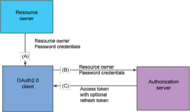

Manual OAuth Server
===================

<!-- toc orderedList:0 depthFrom:1 depthTo:6 -->

* [Manual OAuth Server](#manual-oauth-server)
  * [Introducción](#introducción)
  * [Requerimientos](#requerimientos)
  * [Arquitectura](#arquitectura)
  * [Local](#local)
  * [Instalación](#instalación)
    * [Despliegue](#despliegue)
  * [Configuración](#configuración)
    * [Clientes](#clientes)
    * [LDAP](#ldap)
    * [Logs](#logs)
      * [Auditoría](#auditoría)
      * [Centralización](#centralización)
    * [DB](#db)
    * [CORS Configuration](#cors-configuration)
  * [Alta Disponibilidad](#alta-disponibilidad)
    * [Configuración](#configuración-1)
    * [LDAP](#ldap-1)
    * [DB](#db-1)
  * [DB Scripts](#db-scripts)
  * [LDAP schema](#ldap-schema)
    * [Atributos extendidos](#atributos-extendidos)

<!-- tocstop -->


## Introducción

El servidor OAuth actúa como servidor de Autorización y tiene implementado el esquema típico OAuth2 en su grantType de **resource owner**



Las claves para las aplicación, compuestas por _client_id_ y _client_secret_ se almacenan dentro de un fichero de propiedades del propio servidor.
El servidor se conecta a un OpenLDAP para obtener la información de usuarios.

## Requerimientos
Los requisitos técnicos para el servidor de autorización OAuth2

- Java 8 (para ejecutar aplicaciones Spring Boot)
- Mysql 5.X
- Cliente LDAP

## Arquitectura


## Local

El servidor está preparado para trabajar en local sin ningún tipo de dependencias de base de datos o ldap. Se levanta el servicio son el `profile=local` y carga los datos de db desde `/src/main/resources/db/*.sql` y de ldap desde `/src/main/resources/test-server.ldif`.

> **Nota**: se pueden añadir nuevos usuarios/grupos en el fichero ldif según las necesidades.

## Instalación
El servidor OAuth es un aplicación distribuida via fichero JAR. Esto supone que es auto-ejecutable en un Apache Tomcat como otros aplicación Spring Boot.

### Despliegue
Se utiliza por lo tanto el rol de Ansible [jar-service](TODO-ENLACE) para realizar los despliegues.

Se tendrá que configurar por lo tanto los siguientes parámetros:

|  Fichero  | Atributo  | Valor   | Descripción |
|---|---|---|---|
| JenkinsFile  | provisionWithAnsible  | jar-service | [ver ref.](TODO-ENLACE) |
|  cddelivery/site.yml |  roles  | jar-service  | [ver ref.](TODO-ENLACE) |
|  cddelivery/vars/main.yml | app_service_name  |  oauth-server-corresponsales | nombre del servicio en la máquina |
|  cddelivery/vars/main.yml | app_jar_name  |  oauth-server-corresponsales | nombre del artefacto generado y desplegado |
|  cddelivery/vars/main.yml | app_root_path  |  /var/movcli | directorio de destino del artefacto en la máquina |
|  cddelivery/vars/main.yml | app_http_port  |  6772 | puerto http del servicio |
|  cddelivery/vars/main.yml | app_test_endpoint | "/uaa/oauth/token" | url de check despliegue correcto |


## Configuración
La configuración consiste en un fichero de configuración por entorno que se despliega con la aplicación.


### Clientes
Se identifican las aplicaciones que permiten acceso a los recursos. Su definición se encuentra dentro del fichero `applicacion.yml` en la propiedad **oauth2.client**. Los valores permitidos son los siguientes:

| Valor                          | Descripción             |
|--------------------------------|-------------------------|
| id                             | identificador del cliente |
| resource-id                    | identificador del recurso |
| client-id                      | identificador de la aplicación cliente |
| client-secret                  | contraseña de la aplicación cliente |
| authorized-grant-types         | tipos de grant type |
| access-token-validity-seconds  | tiempo de validez del access token |
| refresh-token-validity-seconds | tiempo de validez del refresh token |
| scopes                         | scopes activos del cliente |

>**Nota**: la configuración sólo funciona para un cliente. Se podría extender para que acepte varios.

Ejemplo de configuración

```yml
oauth2:
  client:
    id: portal
    resource-id: portal
    client-id: demo
    client-secret: secret_demo
    authorized-grant-types: password, refresh_token
    access-token-validity-seconds: 60
    refresh-token-validity-seconds: 600
    scopes: read, write, trust       
```

### LDAP

En esta sección se detallan los parámetros del LDAP en los que se van a almacenar los usuarios y sus permisos (asociados a grupos). Su definición se encuentra dentro del fichero `applicacion.yml` en la propiedad **ldap**


| Valor                          | Descripción             | Ejemplo                 |
|--------------------------------|-------------------------|-------------------------|
| url                            | la url del servidor LDAP | ldap://52.213.132.189:389 |
| rootDn                         | el DN principal | dc=fmbbva,dc=org |
| userSearch                     | ldap search de usuario. **Para corresponsales se ha decidido buscar por el identificador de usuario.** | (uid={0}) |
| groupSearchBase                | ldap search raíz para búsqueda de grupos | ou=groups |
| searchFilter                   | junto al valor de  _groupSearchBase_ se encarga de poblar los _authorities_  | (member={0}) |
| managerDn | el usuario con permisos para modificar LDAP | cn=oauth,ou=applications,dc=fmbbva,dc=org |
| managerPwd | la constraseña del usuario | ***** |

Ejemplo de configuración:

```yml
ldap:
  url: ldap://52.213.132.189:389
  rootDn: dc=fmbbva,dc=org
  userSearch: (uid={0})
  groupSearchBase: ou=groups
  searchFilter: (member={0})
  managerDn: cn=oauth,ou=applications,dc=fmbbva,dc=org
  managerPwd: movclioauth
```

### Logs

En esta sección se describe los distintos parámetros que pueden ser configurados para gestionar los logs, basados en SLF4J.

Se pueden definir los tipos de categorías que se necesiten, por ejemplo:

- ROOT: logger principal del que heredan el resto de logs
- Aplicación: logger de aplicaciones que pueden trazar comportamiento de usuarios y de la propia aplicación


| Valor      | Descripción |
|------------|-------------|
| logging.pattern.console | patrón para utilizar console (stdout) totalmente configurable  |
| logging.level.ROOT | Nivel de trazas de log para el principal. Values INFO, DEBUG, WARN, ERROR |
| Applicación: logging.level.org.fmbbva.movcli.security.oauth logging.level.org.springframework   logging.level.org.springframework.security logging.level.org.springframework.security.oauth2         | Nivel de trazas de log para el  aplicación. INFO, DEBUG, WARN, ERROR |

Ejemplo configuration:
```yml
# Log levels
logging:
  pattern:
    console = "%d{HH:mm:ss.SSS} [%thread] %-5level %logger{36} - %msg %n"
  level:
    ROOT: INFO
    org.fmbbva.movcor.security.oauth: INFO
    org.springframework: INFO
    org.springframework.security: INFO
    org.springframework.security.oauth2: INFO
```

#### Auditoría

El servidor de OAuth tiene habilitadas las trazas por defecto. Para deshabilitarlas es necesario actualizar los logs del servicio de configuración y cambiar el nievel de `org.fmbbva.movcor.security.oauth.audit` a **OFF**.

El formato es igual para el resto de las aplicaciones. Sin embargo, el mensage de las trazas tiene el siguiente formato *AUDIT -- %msg*.

Ejemplo de configuración:
```yml
# Log levels
logging:
  pattern:
    console = "%d{HH:mm:ss.SSS} [%thread] %-5level %logger{36} - %msg %n"
  level:
    ROOT: INFO
    org.fmbbva.movcor.security.oauth: INFO
    org.fmbbva.movcor.security.oauth.audit: OFF
```

Ejemplo de traza:
```
17:44:52.180 [http-nio-8443-exec-7] INFO  o.f.m.s.o.a.OAuthServerAuditAspect - AUDIT -- Comprobar token: timestamp 'Mon Jun 27 17:44:52 CEST 2016' nombre método: 'checkToken' parámetros: '[985b67a0-2e45-4f4f-b47d-573ac68b94e9]'
```

#### Centralización

Como el resto de las aplicaciones del **Portal de Movilidad Clientes** los logs de auditoría se centralizan en la plataforma ELK.

Para ello, se configura creando un o varios _logger_ dentro del fichero `application.yaml` con los siguientes parámetros dentro del atributo movcli.

| Parámetro  | Descripción |
|------------|-------------|
| logstash | logger de tipo logstash |
| logstash.name | Nombre del logger. En el código Java se obtendrá con el mismo nombre `private static Logger logger = LoggerFactory.getLogger("auditlog");` |
| appender.destination | la IP y puerto de _logstash_ |
| appender.encoder.includeMDC | se indica para que el logger tenga posibilidad de acceder al contexto de ejecución. **Cobra mayor sentido cuando son loggers personalizados** |

Ejemplo de logger
```yml
mocli:
  logger:
    logstash:
      - name: auditlog         
        appender:           
          destination: 34.248.186.31:4561         
          encoder:           
            includeMDC: true
```

### DB
En esta sección se describe la configuración que se necesita para
This section describes the configuration required to connect to the MySQL database of S.O.S.


| Parámetro | Descripción |
|-----------|-------------|
| driver | el driver de conexión para la base de datos |
| url | la URL de conexión para la base de datos |
| user | usuario que se conecta a la base de datos |
| password  | La password para conectarse a la base de datos |
| initialSize | Número inicial de conexiones arrancadas cuando el pool es arrancado. Por defecto 10 |
| minIdle | El número mínimo de conexiones idle o establecidas. Por defecto 10 |
| maxActive | Número máximo de conexiones manejadas por este pool.Por defecto = 100 |
| maxIdle | El máximo tamaño del pool idle. Por defecto = 50 |
| timeBetweenEvictionRunsMillis | The sleep time in between validations in milliseconds. Default value = 30000                                                  |
| removeAbandoned | Poner a _true_ si las conexiones abandonadas pueden cerrarse y devolverse al pool. Valor por defecto = true                         |
| removeAbandonedTimeout | El tiempo en segundos antes de de que una conexión se considere abandonada. Valor por defecto = 60                                  |
| logAbandoned | Se configura con _true_ si se quiere volcar las trazas cuando getConnection() es llamada. Por defecto = true                           |
| testWhileIdle | _true_ si tiene que existir validación cuando existen idle checks. Por defecto = true                                                 |


Ejemplo de configuración:
```yml
oauthData:
  database:
    driver: com.mysql.jdbc.Driver
    url: jdbc:mysql://52.213.132.189/oauth
    user: oauthuser
    password: movclioauth
    initialSize: 10
    minIdle: 10
    maxActive: 100
    maxIdle: 50
    timeBetweenEvictionRunsMillis: 30000
    removeAbandoned: true
    removeAbandonedTimeout: 60
    logAbandoned: true
    testWhileIdle: true
```

### CORS Configuration

Se describe la configuración del filtro CORS (Cross-Origin Resource Sharing) para habilitar las solicitudes desde el cliente en distinto dominio que le OAuth Server.
Esta configuración está dentro del fichero `application.yaml` con los siguientes parámetros dentro del atributo movcli.

| Parámetros | Description |
|------------|-------------|
| enabled | Activa el filtro CORS |
| mapping | Parámetros de path sobre los que el filtro CORS va a estar habilitado. Permite mapeos exactos de URIs y patrones ant como "/admin/**" |
| allowedOrigins | Orígenes permitidos desde los que poder acceder. El valor es una colección de strings separados por comas. |
| allowedMethods | Métodos permitidos.El valor es una colección de strings separados por comas. |
| maxAge | La cantidad de segundos que un user-agent puede cachear la respuesta en el preflight                                                   |

Configuration example:

```yml
movcli:      
  cors:
      enabled: true
      mapping: "/**"
      allowedOrigins: "*"
      allowedMethods: POST,GET,OPTIONS,DELETE
      maxAge: 3600
```

## Alta Disponibilidad

Los requerimientos de sistema para alta disponibilidad se enumeran a continuación.

### Configuración
Las instancias deben tener el mismo fichero de configuración para acceder a los repositorios de información compartidos.

> **Nota**: observar comportamiento en  el flujo de "Authorization Code"

### LDAP
No se require ninguna configuración específica si LDAP está balanceado o replicado.

### DB
La URL de conexión a la base de datos debe corresponder al nodo de MariaDB. No es posible configuración en cluster por driver.

- *jdbc:mysql//primaryhost,secondaryhost1,secondaryhost2/test*

La configuración anterior URL `oauthData.database.url` no asegura la calidad de los datos.

## DB Scripts
Se documentan a continuación los scripts de creación de base de datos para almacenar los _tokens_.

- ***createdb.sql***: Ejemplo de esquema/usuario.
```
create database oauth;
grant all privileges on oauth.* to 'oauthuser'@'*' identified by "movclioauth";
```

- ***schema.sql***: tablas para tokens.
```sql
create table oauth_access_token (
  token_id VARCHAR(255),
  token MEDIUMBLOB,
  authentication_id VARCHAR(255) PRIMARY KEY,
  user_name VARCHAR(255),
  client_id VARCHAR(255),
  authentication MEDIUMBLOB,
  refresh_token VARCHAR(255)
);

create table oauth_refresh_token (
  token_id VARCHAR(255),
  token MEDIUMBLOB,
  authentication MEDIUMBLOB
);

create table oauth_code (
  code VARCHAR(255), authentication MEDIUMBLOB
);
```

> **Notas**: los scripts se encuentran en `/src/main/resources/db/`

## LDAP schema

El esquema LDAP se encuentra en un fichero con formato LDIF. El esquema tiene que ser importado en el servidor LDAP para almacenar los usuarios.

```ldif
version: 1

dn: ou=groups,dc=fmbbva,dc=org
objectclass: top
objectclass: organizationalUnit
ou: groups

dn: ou=people,dc=fmbbva,dc=org
objectclass: top
objectclass: organizationalUnit
ou: people

dn: cn=admin,ou=groups,dc=fmbbva,dc=org
objectclass: top
objectclass: groupOfNames
cn: admin

dn: cn=user,ou=groups,dc=fmbbva,dc=org
objectclass: top
objectclass: groupOfNames
cn: user
```
Un ejemplo de usuario dentro de un grupo

```ldif
dn: uid=corresponsal1,ou=people,dc=fmbbva,dc=org
objectclass: top
objectclass: person
objectclass: organizationalPerson
objectclass: inetOrgPerson
cn: Corresponsal Uno (01)
sn: Corresponsal
uid: corresponsal1
userPassword: {SHA}nU4eI71bcnBGqeO0t9tXvY1u5oQ=

dn: cn=user,ou=groups,dc=fmbbva,dc=org
objectclass: top
objectclass: groupOfNames
cn: user
member: uid=corresponsal1,ou=people,dc=fmbbva,dc=org

dn: cn=admin,ou=groups,dc=fmbbva,dc=org
objectclass: top
objectclass: groupOfNames
cn: admin
member: uid=corresponsal1,ou=people,dc=fmbbva,dc=org
```
### Atributos extendidos

Para el **Portal de Movilidad** se han utilizado atributos del objeto **inetOrgPerson** estándar LDAP y que reflejen los valores requeridos.

 - **l** : código del país
 - **employeeType**: tipo de documento/cédula
 - **employeeNumber**: documento/cédula

 > **Nota**: estos atributos se devuelven dentro del atributo **user_info** cuando se accede a la información del token 
